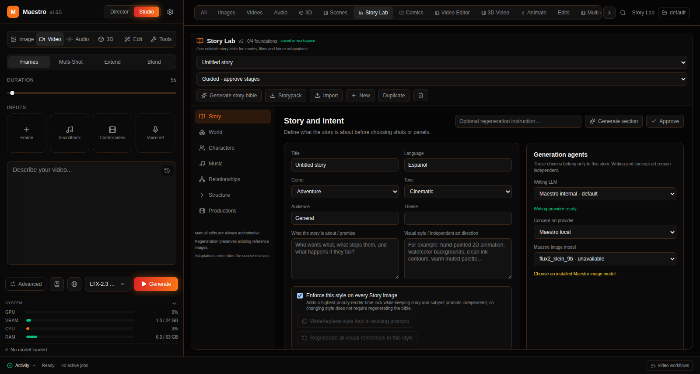
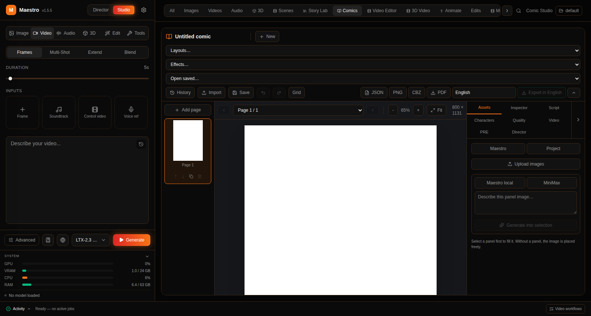
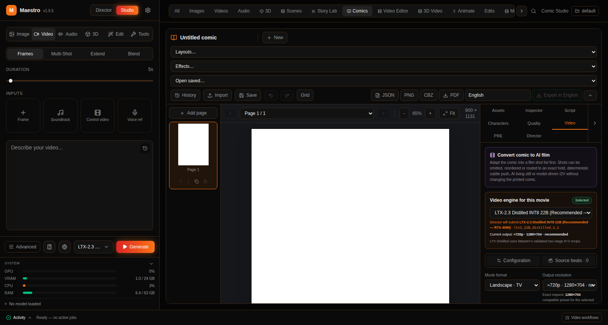
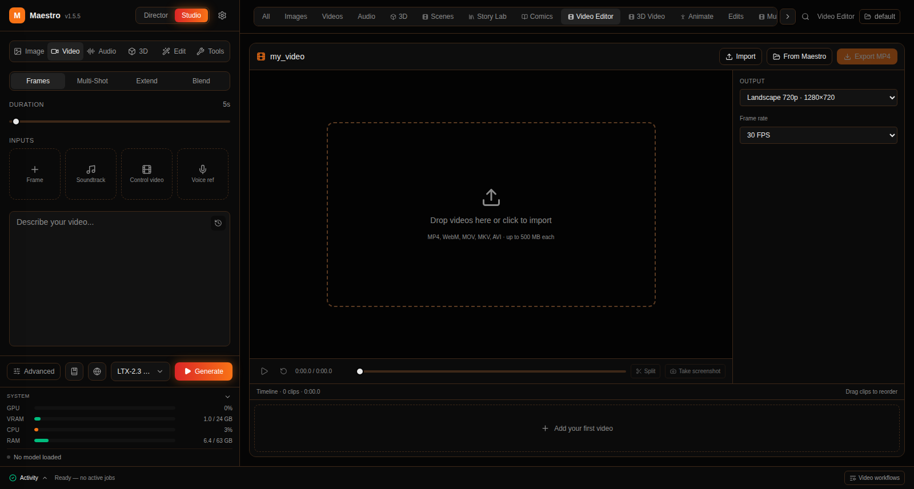

# Guía de pestañas de HocusPocus

Manual de uso para quien está sentado en la aplicación. Una sección por cada superficie que la UI nombra hoy. Las etiquetas entre comillas son las del interfaz, en el idioma en que aparecen (casi todo en inglés).

No es una auditoría ni una hoja de ruta. Si un control no está claro en el código, se omite.

Guías de operador más largas (límites, APIs, recuperación):

- [HOWUSEIT (índice)](https://github.com/IAnMove/loreframe-studio/blob/cursor/guia-tabs-usuario-3905/docs/HOWUSEIT.md)
- [Video Editor](https://github.com/IAnMove/loreframe-studio/blob/cursor/guia-tabs-usuario-3905/docs/video-editor/HOWUSEIT.md)
- [Workspaces (hilos de Director)](https://github.com/IAnMove/loreframe-studio/blob/cursor/guia-tabs-usuario-3905/docs/workspaces/HOWUSEIT.md)
- [3D Video](https://github.com/IAnMove/loreframe-studio/blob/cursor/guia-tabs-usuario-3905/docs/3d-video-compositor/HOWUSEIT.md)
- Recorrido Story → Comics → vídeo: [MAESTRO_X_STORY_COMICS_VIDEO.md](https://github.com/IAnMove/loreframe-studio/blob/cursor/guia-tabs-usuario-3905/docs/MAESTRO_X_STORY_COMICS_VIDEO.md)

## Capturas que faltan

Las únicas fotos incrustadas más abajo son **de la era Maestro** (logo Maestro, pie `Video workflows`, Video Editor `From Maestro`). **No son la UI actual de HocusPocus.** Cada una lleva un aviso visible.

Solo placeholders. No subir capturas del escritorio ni de la máquina personal (ni ningún PNG sacado ahí): contienen datos privados y no van a este repo. Las fotos de producto se harán aparte, en la 4090, cuando toque. GitHub devolverá 404 en estos enlaces hasta que exista ese archivo de producto. Una frase por toma: pestaña + qué debe verse.

| Archivo (clic) | Toma |
|---|---|
| [director.png](https://github.com/IAnMove/loreframe-studio/blob/cursor/guia-tabs-usuario-3905/docs/images/tabs/director.png) | Barra izquierda en `Director`: bienvenida «Welcome to HocusPocus Director» y las tarjetas `Music Video`, `Short Film`, `Comic`. |
| [gallery-all.png](https://github.com/IAnMove/loreframe-studio/blob/cursor/guia-tabs-usuario-3905/docs/images/tabs/gallery-all.png) | Pestaña `All` con feed, miniaturas a la derecha y selector de workspace. |
| [videoclips-trailers-capitulos.png](https://github.com/IAnMove/loreframe-studio/blob/cursor/guia-tabs-usuario-3905/docs/images/tabs/videoclips-trailers-capitulos.png) | Barra superior con `Videoclips`, `Tráilers` y `Capítulos` visibles y una de ellas activa. |
| [scenes.png](https://github.com/IAnMove/loreframe-studio/blob/cursor/guia-tabs-usuario-3905/docs/images/tabs/scenes.png) | Pestaña `Scenes` con una escena guardada o el vacío «compositor scenes». |
| [studio-3d.png](https://github.com/IAnMove/loreframe-studio/blob/cursor/guia-tabs-usuario-3905/docs/images/tabs/studio-3d.png) | Studio → `3D`: panel `Hunyuan3D Studio` con `Generate model` / `Retexture GLB`. |
| [3d-video.png](https://github.com/IAnMove/loreframe-studio/blob/cursor/guia-tabs-usuario-3905/docs/images/tabs/3d-video.png) | Pestaña `3D Video`: lienzo, `Open scene`, `Save scene`, `Add layer`. |
| [animate.png](https://github.com/IAnMove/loreframe-studio/blob/cursor/guia-tabs-usuario-3905/docs/images/tabs/animate.png) | Pestaña `Animate`: título `Rig & Animate` y botón `Rig & animate`. |
| [character-creator.png](https://github.com/IAnMove/loreframe-studio/blob/cursor/guia-tabs-usuario-3905/docs/images/tabs/character-creator.png) | `Character Creator` con `Personaje`/`Objeto` y `Generar órbita 360`. |
| [series-lab.png](https://github.com/IAnMove/loreframe-studio/blob/cursor/guia-tabs-usuario-3905/docs/images/tabs/series-lab.png) | `Series Lab` con las cinco pestañas `1 · Setup` … `5 · Render & review`. |
| [workspaces.png](https://github.com/IAnMove/loreframe-studio/blob/cursor/guia-tabs-usuario-3905/docs/images/tabs/workspaces.png) | Pestaña `Workspaces`: lista de hilos a la izquierda y cola de planos. |
| [hoja-de-estilos.png](https://github.com/IAnMove/loreframe-studio/blob/cursor/guia-tabs-usuario-3905/docs/images/tabs/hoja-de-estilos.png) | `Hoja de estilos` con la biblioteca MiniMax y `Copiar prompt`. |
| [edits.png](https://github.com/IAnMove/loreframe-studio/blob/cursor/guia-tabs-usuario-3905/docs/images/tabs/edits.png) | Pestaña `Edits` (galería) o Studio → `Edit` con `Retake` / `Edit Anything` / `Outpaint` / `Repaint` / `Recast`. |
| [multi-clip.png](https://github.com/IAnMove/loreframe-studio/blob/cursor/guia-tabs-usuario-3905/docs/images/tabs/multi-clip.png) | Studio → Video → `Multi-Shot`, o pestaña de galería `Multi-clip`. |
| [activity-footer.png](https://github.com/IAnMove/loreframe-studio/blob/cursor/guia-tabs-usuario-3905/docs/images/tabs/activity-footer.png) | Pie `Activity` abierto: título `HocusPocus tasks` y botón `Workspaces`. |
| [settings.png](https://github.com/IAnMove/loreframe-studio/blob/cursor/guia-tabs-usuario-3905/docs/images/tabs/settings.png) | Cajón `Settings` con pestañas `Performance` e `Integrations`. |
| [favorites.png](https://github.com/IAnMove/loreframe-studio/blob/cursor/guia-tabs-usuario-3905/docs/images/tabs/favorites.png) | Pestaña `Favorites` con al menos un favorito o el vacío. |

## Cómo está la pantalla

Tres franjas fijas:

1. **Barra izquierda** — conmutador `Director` / `Studio`. Ahí se genera. El engranaje abre `Settings`.
2. **Barra superior** (`Workspace sections`) — pestañas del área central. En móvil se acortan (`Img`, `Vid`, `Lab`…). La lupa busca en la galería (`Search...`).
3. **Pie** — `Activity` (trabajos, ETA, historial) y un botón `Workspaces` que abre la pestaña de hilos de Director.

A la derecha de las pestañas: selector de carpeta de salidas (`default`, otras, `Uploads`, `New Workspace`). No es la pestaña `Workspaces`.

En móvil: menú hamburguesa para la barra izquierda; el engranaje está en la cabecera.

---

## `Director` / `Studio` (barra izquierda)

Dos botones arriba a la izquierda. `Studio` = un asset a mano. `Director` = un flujo planificado (videoclip, corto, cómic).

`Director` se puede plegar (icono de panel); queda un rail vertical con la palabra `Director`. `Expand Director panel` lo vuelve a abrir.

> **Aviso: captura de la era Maestro. No es la UI actual de HocusPocus.** Logo Maestro, menos pestañas arriba, pie distinto. Solo sirve para reconocer la zona Studio + galería.

Foto HocusPocus pendiente: [director.png](https://github.com/IAnMove/loreframe-studio/blob/cursor/guia-tabs-usuario-3905/docs/images/tabs/director.png).

---

## `Studio`

Barra izquierda → `Studio`. Arriba: `Image`, `Video`, `Audio`, `3D`, `Edit`, `Tools`.

Abajo, salvo en `Tools` y `3D`: icono de recetas (`Recipes — one-click presets`), globo de LoRAs (`Browse LoRAs on CivitAI`), selector de modelo, botón `Generate` (o `Go (n)` si ya hay cola). `Advanced` abre opciones del modelo.

La primera vez que usas un modelo se descargan los pesos; el progreso sale abajo a la derecha.

### `Image`

1. `Studio` → `Image`.
2. Escribe en `Describe your image...`.
3. Si el modelo lo admite, añade referencias en la sección de imágenes.
4. Elige modelo → `Generate`.
5. El resultado cae en `Images` / `All`.

### `Video`

1. `Studio` → `Video`.
2. Si el modelo lo permite, elige submodo: `Frames`, `Multi-Shot`, `Extend`, `Blend`. Si solo hay uno, la fila no aparece.
3. Ajusta la duración (no aplica en `Blend`).
4. `Frames`: teselas `+ Frame`, soundtrack, vídeo de control, voz, según el modelo. `Extend` pide el vídeo origen. `Blend` usa sus propios anclajes. Algunos modelos i2v muestran: «This model requires a start image to generate video.»
5. Prompt: `Describe your video...`.
6. Modelo → `Generate`. Si falta algo, el botón pasa a `Need image`, `Need reference`, `Need source`, `Choose canvas` o `Add prompt`.

`Multi-Shot` es el editor de varios clips en Studio (prompts por clip). No confundir con la pestaña de galería `Multi-clip`.

### `Audio`

1. `Studio` → `Audio`.
2. Submodos: `Speech`, `Music`, `SFX`, `Mixer`.
3. `Speech`: texto en `Enter text to speak or describe audio...` y controles de voz.
4. `Music` / `SFX` / `Mixer`: cada uno tiene su propio panel (no el cuadro de prompt genérico).
5. `Generate`.

### `3D` (Studio · Hunyuan3D)

No es la pestaña de galería `3D`. Aquí se **crea** el mesh.

1. `Studio` → `3D`. Título: `Hunyuan3D Studio`.
2. `Generate model` o `Retexture GLB`.
3. Elige `Performance profile` y `Hunyuan model`.
4. Texto en `Prompt or reference image`, o sube vistas `Front` / `Left` / `Right` / `Back` (`Upload` o `HocusPocus` para coger una imagen del workspace). En multi-vista, `Front` es obligatorio.
5. `Generate 3D asset` (o `Create retextured GLB copy`). Cancela con `Cancel 3D generation`.
6. El GLB aparece en la pestaña de galería `3D`.

Si sale `Hunyuan3D runtime is not installed`, el runtime no está en esta máquina.

Foto HocusPocus pendiente: [studio-3d.png](https://github.com/IAnMove/loreframe-studio/blob/cursor/guia-tabs-usuario-3905/docs/images/tabs/studio-3d.png).

### `Edit`

1. `Studio` → `Edit`.
2. Submodos: `Retake`, `Edit Anything`, `Outpaint`, `Repaint`, `Recast`. `Inpaint` solo si en Settings está `Show in-development features`.
3. Cada submodo pide su origen (vídeo/imagen) y un prompt.
4. `Generate`.

La pestaña de galería `Edits` lista esos resultados.

### `Tools`

1. `Studio` → `Tools`. Título: `Tools — post-process any clip`.
2. `Upscale` o `Revoice`.
3. `Source Clip`: `Upload a video clip` o `Use selected gallery clip`.
4. `Upscale` → método → `Upscale Clip`. `Revoice` → `Single Voice` / `Two Voices` → `Replace Voice`.

No hay `Generate` abajo: el panel tiene su propio botón.

---

## `Director`

Barra izquierda → `Director`.

1. «Welcome to HocusPocus Director. Choose a skill to get started.»
2. Tarjetas activas:
   - `Music Video` — «Automated music video from audio»
   - `Short Film` — «Dialogue-driven scenes from audio»
   - `Comic` — «Plan pages, panels, art and dialogue» (abre `Comic Director`)
3. `Video Podcast` y `Viral Video` muestran `Soon` / `Coming Soon`: no se pueden usar.

**Music Video**

1. `Upload a track` o `Generate a track`.
2. Opcional: imagen de referencia. Audio: «Drop a song or video or click to upload».
3. Describe el videoclip en el composer (`Describe your music video — subject, vibe, mood, setting…`) y envía.
4. Abajo: `Seamless` (si el modelo lo admite) y `Auto` (pipeline entero sin parar en cada paso).
5. En revisión: `Start Image Prompts` → `Generate Start Images` → `Video Prompts` → `Generate`. `Regenerate` rehace el bloque. `Edit in Studio` manda un plano a Studio.

**Short Film**

1. `Upload Audio` («Upload recorded dialogue») o `Describe a Story` («AI writes the script»).
2. Si subes audio: «Drop dialogue audio or click to upload».
3. Revisa prompts de imagen y vídeo igual que en Music Video.

**Comic**

La barra pasa a `Comic Director`. El lienzo del cómic está en la pestaña `Comics`.

No hay tarjeta `Trailer` aquí. Los tráilers se crean en Story Lab (`Tráiler cinematográfico` o la sección `Tráiler`).

---

## Galería: `All`, `Images`, `Videos`, `Audio`

Pestañas de filtro del feed. No cambian la barra izquierda.

- `All` — todo el workspace activo.
- `Images` — estáticos.
- `Videos` — clips (incluye exports del compositor y del editor).
- `Audio` — voz, música, SFX.

Cómo usarlas:

1. Pulsa la pestaña.
2. El feed central muestra el ítem; a la derecha, miniaturas.
3. En un vídeo: `Editar vídeo en Video Editor`, `Re-generate with same settings`, `Retake — regenerate a time region`, `Extend this video with new content`, `Copy prompt`, `Save as Recipe`, favorito, descargar, borrar.
4. Vacío: «Your generated … will appear here.» + `Browse recipes`.

> **Aviso: captura de la era Maestro. No es la UI actual de HocusPocus.** Misma foto antigua: feed de `All` con metadatos y acciones; no uses las etiquetas del pie ni el recuento de pestañas.

Foto HocusPocus pendiente: [gallery-all.png](https://github.com/IAnMove/loreframe-studio/blob/cursor/guia-tabs-usuario-3905/docs/images/tabs/gallery-all.png).

---

## `Videoclips`, `Tráilers`, `Capítulos`

Filtros de **montajes ya ensamblados** (Director / Series / Story Lab), no el editor de corte.

- `Videoclips` — videoclips unidos.
- `Tráilers` — tráilers unidos.
- `Capítulos` — episodios de Series Lab.

Para montar a mano: `Video Editor`. Detalle de mezclas: [video-editor/HOWUSEIT.md](https://github.com/IAnMove/loreframe-studio/blob/cursor/guia-tabs-usuario-3905/docs/video-editor/HOWUSEIT.md).

Foto HocusPocus pendiente: [videoclips-trailers-capitulos.png](https://github.com/IAnMove/loreframe-studio/blob/cursor/guia-tabs-usuario-3905/docs/images/tabs/videoclips-trailers-capitulos.png).

---

## `3D` (galería)

Lista los GLB ya generados. Para crear uno: Studio → `3D` o `Character Creator`.

Vacío: «Open Character Creator or the 3D sidebar and generate a Hunyuan3D asset.»

---

## `Scenes`

Escenas JSON + preview PNG guardadas desde `3D Video` (`Save scene`). No es el compositor.

Vacío: «Save a scene from the 3D Video compositor.»

Foto HocusPocus pendiente: [scenes.png](https://github.com/IAnMove/loreframe-studio/blob/cursor/guia-tabs-usuario-3905/docs/images/tabs/scenes.png).

---

## `Story Lab`

Biblia editable de una producción (historia, videoclip, tráiler o vídeo rápido).

> **Aviso: captura de la era Maestro. No es la UI actual de HocusPocus.** Marca «Maestro v1.5.5»; faltan secciones actuales (`Assets`, `Tráiler`, `Assembly` en historia completa).

**Empezar**

1. Pestaña `Story Lab`.
2. `New` → tipo:
   - `Historia completa` — «Mundo, personajes, estructura, música y adaptaciones.»
   - `Videoclip` — «Canción original y una historia visual construida alrededor de ella.»
   - `Tráiler cinematográfico` — «Tráiler de película…; no requiere canción.»
   - `Vídeo rápido` — «Diálogo, meme, parodia, sketch, viral o anuncio breve.»
3. Modo: `Guided · approve stages` (apruebas cada bloque) o `Automatic · one click`.
4. `Storypack` / `Import` / `Duplicate` según necesites.

**Historia completa** — secciones: `Story`, `Assets`, `World`, `Characters`, `Music`, `Relationships`, `Structure`, `Tráiler`, `Productions`, `Assembly`.

En `Story`: título, idioma, género, tono, audiencia, premisa, dirección visual. Genera la sección y, en Guided, `Approve` antes de seguir.

**Videoclip:** `Videoclip`, `Imágenes`, `Canción`, `Tráiler`, `Generar`, `Montaje`.  
**Tráiler:** `Tráiler`, `Imágenes`, `Crear tráiler`, `Montaje`.  
**Vídeo rápido:** `Vídeo rápido`, `Imágenes`, `Tráiler`, `Generar`, `Montaje`.

En móvil: «Desliza para más secciones».

**Productions / Generar** (dentro de Story Lab)

- Cómic: `Open in Comic Director` o `Generate complete comic chapter`.
- Corto: `Open in Short Film Director` o `Generate complete short film`.
- Videoclip / vídeo rápido: `Generar videoclip` / `Generar vídeo rápido` / `Generar vídeo rápido completo` / `Abrir en Director`.
- Tráiler: `Generar tráiler completo`.

`Assembly` / `Montaje` sirve para unir y revisar el resultado. Recorrido (también con fotos de la era Maestro): [MAESTRO_X_STORY_COMICS_VIDEO.md](https://github.com/IAnMove/loreframe-studio/blob/cursor/guia-tabs-usuario-3905/docs/MAESTRO_X_STORY_COMICS_VIDEO.md).

---

## `Series Lab`

Canon que tiene que aguantar varios episodios.

1. Pestaña `Series Lab`.
2. `New` (serie vacía) o `Story` (importar una biblia de Story Lab). Vacío: «Create an empty original series or import an existing Story Lab bible.» / `Create original series`.
3. Cinco pasos:
   1. `1 · Setup` — `Title`, `Premise` y `Visual style` son obligatorios. Formato `Episodic` / `Serial` / `Hybrid`. `Spoken video language` (p. ej. `Español de España`). `Build known-series bible` si partes de un universo conocido. Luego `Prepare canon text` o `Prepare canon + up to 4 images`.
   2. `2 · Canon` — revisa y `Review and approve canon`. Sin esto no hay episodio.
   3. `3 · Episode room` — crea o abre un `Episode`.
   4. `4 · Shots` — planos del episodio.
   5. `5 · Render & review` — genera y revisa. `Start / resume videos` / `Continue videos` / `Regenerar vídeo completo`.
4. Cabecera: `Saving…` / `Unsaved changes` / `Saved · project rN`.

Los capítulos unidos aparecen en `Capítulos`.

Foto HocusPocus pendiente: [series-lab.png](https://github.com/IAnMove/loreframe-studio/blob/cursor/guia-tabs-usuario-3905/docs/images/tabs/series-lab.png).

---

## `Workspaces` (pestaña)

**No** es el desplegable de carpeta. Esta pestaña es el tablero de **hilos de Director** del workspace activo. Guía: [workspaces/HOWUSEIT.md](https://github.com/IAnMove/loreframe-studio/blob/cursor/guia-tabs-usuario-3905/docs/workspaces/HOWUSEIT.md).

1. Pestaña `Workspaces` (o el botón `Workspaces` del pie).
2. Lista: «El último hilo se abre solo…». Busca en `Buscar hilo…`. Orden `Nuevo → viejo` / `Viejo → nuevo`. `Más hilos (n/total)`.
3. Vacío: «Genera una canción o un vídeo Director y el hilo aparece aquí…»
4. En el detalle: `Start / resume videos` o `Continue videos` si está en pausa. `Regenerar vídeo completo` vuelve a unir.
5. `Queue (n)`: edita prompts, selecciona planos (`Select all` / `Quitar selección`), `Proponer en seleccionados`, `Guardar seleccionados`.

El desplegable de la esquina (también titulado `Workspaces`) cambia la carpeta (`default`, `Create`, papelera salvo `default`) o entra en `Uploads` (solo lectura; las generaciones siguen yendo al workspace real).

Foto HocusPocus pendiente: [workspaces.png](https://github.com/IAnMove/loreframe-studio/blob/cursor/guia-tabs-usuario-3905/docs/images/tabs/workspaces.png).

---

## `Character Creator`

De una foto a órbita 360 y, si quieres, mesh Hunyuan.

1. Pestaña `Character Creator`.
2. `Personaje` u `Objeto`.
3. `Imagen principal del sujeto` (u `objeto`): «Soltar o elegir imagen». Una basta.
4. Opcional: `Añadir referencia opcional` (`Otro ángulo / detalle`, `Solo cara`, `Solo ropa`, `Accesorio / objeto extra`) y `A Prompt opcional`.
5. `Generar órbita 360`.
6. `Take photo · 4 vistas`. Si una vista falla: `Ajustar captura` + sustituir.
7. `Generar Hunyuan3D` cuando hay 4 vistas.
8. El GLB sale en la galería `3D`. `Create / open CharacterKit Face Rig` salta a `3D Video` (puppet 2D; no es este flujo).

Foto HocusPocus pendiente: [character-creator.png](https://github.com/IAnMove/loreframe-studio/blob/cursor/guia-tabs-usuario-3905/docs/images/tabs/character-creator.png).

---

## `Hoja de estilos`

Biblioteca de prompts visuales (fuente MiniMax) para copiar, no un editor de CSS.

1. Pestaña `Hoja de estilos`.
2. Si está vacía: `Descargar estilos de ostris/minimax_h3_1k` (o `Reanudar descarga` / `Sincronizar fuente`).
3. Busca (`Buscar en prompts, nombres o tags…`), filtra colección/grupo, `Copiar prompt`.

El selector de workspace de la barra superior **no** se muestra en esta pestaña.

Foto HocusPocus pendiente: [hoja-de-estilos.png](https://github.com/IAnMove/loreframe-studio/blob/cursor/guia-tabs-usuario-3905/docs/images/tabs/hoja-de-estilos.png).

---

## `Comics`

Editor de cómic (páginas, viñetas, letra, export).

> **Aviso: captura de la era Maestro. No es la UI actual de HocusPocus.** Marca «Maestro v1.5.5»; el pie decía `Video workflows`.

1. Pestaña `Comics` (o `Director` → `Comic`, o Story Lab → `Open in Comic Director`).
2. Barra: `New`, `Layouts…`, `Effects…`, `Open saved…`, `History`, `Import`, `Save`, `Grid`. Export: `JSON`, `PNG`, `CBZ`, `PDF`.
3. Miniaturas de página a la izquierda; lienzo al centro (página, zoom, `Fit`).
4. Panel derecho: `Assets`, `Inspector`, `Script`, `Characters`, `Quality`, `Video`, `PRE`, `Director`.
5. `Script`: revisa diálogos y aprueba antes de gastar imagen.
6. `Quality`: avisos de densidad, continuidad, referencias.
7. `Assets` / `Inspector`: regenera una viñeta o cambia un asset.

**Cómic → película**

> **Aviso: captura de la era Maestro. No es la UI actual de HocusPocus.** Pantalla `Video` del cómic en Maestro v1.5.5.

1. Pestaña `Video` del cómic: motor, formato, motion.
2. Incluye/excluye beats.
3. `Prepare PRE for enabled film shots` → pestaña `PRE`.
4. Aprueba el PRE; genera el film o `Render animatic` (FFmpeg, sin vídeo generativo).
5. Abre el resultado en `Video Editor`.

Detalle: [MAESTRO_X_STORY_COMICS_VIDEO.md](https://github.com/IAnMove/loreframe-studio/blob/cursor/guia-tabs-usuario-3905/docs/MAESTRO_X_STORY_COMICS_VIDEO.md).

---

## `Video Editor`

Corte de clips que **ya existen**. No regenera píxeles. Guía: [video-editor/HOWUSEIT.md](https://github.com/IAnMove/loreframe-studio/blob/cursor/guia-tabs-usuario-3905/docs/video-editor/HOWUSEIT.md).

> **Aviso: captura de la era Maestro. No es la UI actual de HocusPocus.** El botón de importación decía `From Maestro`; hoy es `From HocusPocus`. El pie decía `Video workflows`.

1. Pestaña `Video Editor`, o `Editar vídeo en Video Editor` en una tarjeta de galería.
2. `Import` (archivo local) o `From HocusPocus` (modal `Add HocusPocus videos`). También se puede soltar un vídeo en la zona.
3. Recorta bordes, `Split` en el playhead, reordena arrastrando, elige transición en el hueco (`Hard cut`, `Crossfade`, etc.).
4. Resolución y FPS a la derecha.
5. `Export MP4`. `Cancel` / `Cancelling…` espera al FFmpeg en curso.

---

## `3D Video`

Compositor por capas (imágenes, vídeos, GLB, cámara, atmósfera). No es MiniMax H3. Guía: [3d-video-compositor/HOWUSEIT.md](https://github.com/IAnMove/loreframe-studio/blob/cursor/guia-tabs-usuario-3905/docs/3d-video-compositor/HOWUSEIT.md).

1. Pestaña `3D Video` (cabecera: `3D Video editor`).
2. Nombre de escena (campo editable).
3. `Open scene` / `Save scene` / `Preview` / `Export MP4`.
4. `Add layer` → p. ej. `Add camera` o un efecto (`Atmospheric effect · 14 presets`).
5. Elige assets (`Character / subject`, `Background`, `Choose asset…`).
6. `Save scene` deja un JSON en `Scenes`. `Export MP4` graba el canvas del navegador (deja la pestaña abierta) y el MP4 va a `Videos`.

Foto HocusPocus pendiente: [3d-video.png](https://github.com/IAnMove/loreframe-studio/blob/cursor/guia-tabs-usuario-3905/docs/images/tabs/3d-video.png).

---

## `Animate`

Rig procedural de un GLB estático. Cabecera: `Rig & Animate`.

1. Pestaña `Animate`.
2. Elige el GLB en `3D object`. Vacío: «No GLB outputs yet. Generate an object in the 3D tab first.»
3. `Rig profile / skeleton` y clips (`Recommended` / `All`).
4. Opcional: `Manual rig fit`.
5. `Rig & animate`. Cancela con `Cancel rigging`.
6. `Export animated GLB`. Luego puedes llevarlo a `3D Video`.

Foto HocusPocus pendiente: [animate.png](https://github.com/IAnMove/loreframe-studio/blob/cursor/guia-tabs-usuario-3905/docs/images/tabs/animate.png).

---

## `Edits` (galería)

Filtro de salidas de Studio → `Edit` (`Retake`, `Outpaint`, `Repaint`, etc.). Para **hacer** un edit, usa Studio → `Edit`.

Foto HocusPocus pendiente: [edits.png](https://github.com/IAnMove/loreframe-studio/blob/cursor/guia-tabs-usuario-3905/docs/images/tabs/edits.png).

---

## `Multi-clip` (galería)

Filtro de secuencias multi-clip ya ensambladas. Para **generar** varias tomas a mano: Studio → `Video` → `Multi-Shot`.

Foto HocusPocus pendiente: [multi-clip.png](https://github.com/IAnMove/loreframe-studio/blob/cursor/guia-tabs-usuario-3905/docs/images/tabs/multi-clip.png).

---

## `Favorites`

Ítems marcados con el corazón (`Add to favorites` / `Remove from favorites`). Los favoritos son **por carpeta de workspace**.

Foto HocusPocus pendiente: [favorites.png](https://github.com/IAnMove/loreframe-studio/blob/cursor/guia-tabs-usuario-3905/docs/images/tabs/favorites.png).

---

## `Auditoría interna dev`

Herramienta interna: «marca los clips con alucinación de audio» y `Copiar prompts erróneos`. No es un flujo de producción. Filtro `Solo marcados`.

---

## Pie: `Activity`

Barra inferior izquierda.

1. Pulsa `Activity` para abrir `HocusPocus tasks`.
2. En marcha: fase, tiempo, `ETA`, modelo, `Cancel`.
3. Historial: `Clear history`, `Resume`, `Dismiss`, `Retry` según el estado.
4. Idle: «Ready — no active jobs».
5. `Workspaces` (derecha del pie) abre la pestaña de hilos. Tooltip: «Open Workspaces to inspect prompts, references and the generation queue».

El overlay `Director video workflows` / `Video workflows` sigue en el código (selector `Select an independent creation...`, `Resume`). **No hay un botón visible en el pie que lo abra hoy.** Para pipelines usa la pestaña `Workspaces`. `Productions` como nombre de UI es la sección de Story Lab.

Foto HocusPocus pendiente: [activity-footer.png](https://github.com/IAnMove/loreframe-studio/blob/cursor/guia-tabs-usuario-3905/docs/images/tabs/activity-footer.png).

---

## `Settings`

Engranaje de la barra izquierda (en móvil, en la cabecera). Título: `Settings`.

Dos pestañas:

**`Performance`**

- `Appearance`: `Mode` (`Dark` / `Light` / `Auto`), `Theme`.
- `Performance`: perfil automático del hardware; `Show advanced settings` para `Profiles`, `VRAM Safety Coefficient`, `Output Codecs`.

**`Integrations`**

- `Content Settings` → `NSFW Mode` (disclaimer `Enable Adult Content Mode` si lo activas).
- `LLM Configuration`, `MiniMax API`, `Studio Prompt Enhancer` (si hay features experimentales).
- `Director Architecture` → `Director v2 Engine`.
- `Voice Reference (ID-LoRA)`.
- `Beta Features` → `Show in-development features` (APIs externas de escritura, Prompt Enhancer, `Inpaint`).

Foto HocusPocus pendiente: [settings.png](https://github.com/IAnMove/loreframe-studio/blob/cursor/guia-tabs-usuario-3905/docs/images/tabs/settings.png).
