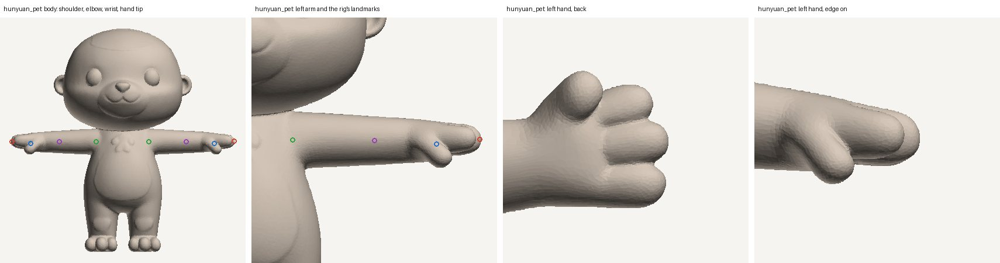
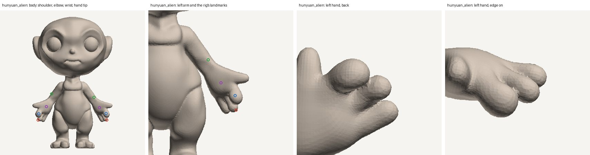
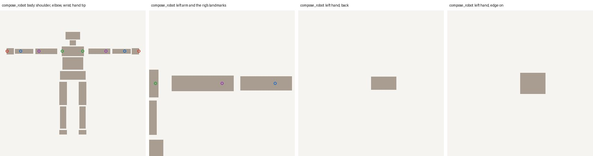
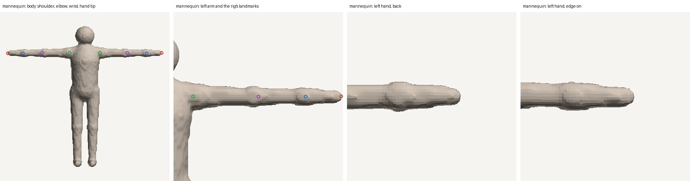

# Humanoid hands: research before adding finger bones

Phase 4.F5 of the local-quality roadmap (`docs/development/calidad-local/04-personajes-3d.md`, section «Fase 5 · Manos»).
It had two parts:

- **(a)** Retarget finger tracks when the destination has fingers.
- **(b)** Research a thumb and a finger block for our own rig. The research comes with captures on three real meshes and
  goes before any integration.

No rig code changes in this phase. The decision on what to integrate is the user's.

## Short answer

- **(a) does not apply today.** The destination of a retarget is always our 25-bone skeleton, and it has no fingers.
- **(b) The generated meshes support a thumb and a finger block, not five fingers.**
  - Both Hunyuan meshes have cartoon hands with four digits: a thumb that stands apart and three fingers that touch along
    their length.
  - The box robot has a rigid block and the mannequin a mitten.
- **The wrist comes first.**
  - The rig places the wrist at a fixed 76 % of the arm line. On the alien it lands on the finger block, so the palm and the
    thumb move with the forearm.
  - On the robot the elbow and the wrist sit 9–11 cm inside the boxes, before the gaps where the parts really join.
  - Any hand bone needs the wrist at the root of the hand.
- **Recommendation.**
  - Do not add per-finger bones.
  - If the user wants better hands, first place the wrist and elbow from the mesh's shape. That fixes every clip, not only
    hands.
  - Then, optionally, add a thumb and a finger block. They are worth it in medium shots and close-ups.

## (a) Finger retarget

- **The destination never has fingers.**
  - `animate.stored_rig` builds the motion rig from a GLB rigged with the standard skeleton (`names.py`, 25 bones).
  - Every retarget lands on it (`retarget.retarget_file(payload, kind, rig)`).
- **Finger joints are skipped and counted.**
  - `retarget_names.bone_for` maps `mixamorig:LeftHandIndex1` to nothing.
  - `_mapping_warnings` reports «N joints were not used (fingers, props or extra bones)».
- **Characters that already carry their own skeleton are not retargeted.**
  - Video 3D plays their clips with three.js's `AnimationMixer`, which plays every track in a clip, finger tracks included.

So there is nothing to map yet. Part (a) becomes real only when the rig gets hand bones: the retarget would then map the
Mixamo and VRM thumb chain to the thumb and average the four finger chains into the block.

## (b) Method

`scripts/dev/humanoid_hand_captures.py` renders gray clay captures: geometry only, orthographic, no texture.

```bash
python scripts/dev/humanoid_hand_captures.py --out OUT pet=pet.glb alien=alien.glb robot=robot.glb mannequin=mannequin.glb
```

Each sheet has four views:

- the body, with the rig's arm landmarks: shoulder green, elbow purple, wrist blue, hand tip red;
- the left arm close up;
- the left hand seen from the back;
- the left hand seen edge on.

The hand views keep only the mesh piece connected to the hand tip, so a thigh or the torso beside the hand does not show.
`hands.json` lists sizes and triangle counts. It also gives, per tenth of the hand from the landmark wrist to the tip, the
most separate pieces a cut across the back view meets. Fingers that touch count as one piece, which is the point: a bone
can only bend what is apart.

Meshes:

- **Hunyuan pet.** Hunyuan3D 2 Mini Turbo, the T-pose generation documented in `docs/agents/HUMANOID_RIG.md`.
- **Hunyuan alien.** Hunyuan3D, A pose.
- **Box robot.** Composed from primitives.
- **Mannequin.** Synthetic control, with no fingers by construction.

## Results (2026-10-03)

| Mesh | Triangles | Height | Hand (landmarks) | Hand triangles | Pieces per tenth, wrist → tip | Reading |
|---|---|---|---|---|---|---|
| Hunyuan pet | 80,000 | 0.99 m | 0.089 m (9 %) | 6,249 | 1 1 1 1 1 1 1 2 2 2 | Thumb apart; 3 fingers touching |
| Hunyuan alien | 278,424 | 0.99 m | 0.051 m (5 %) | 9,716 | 1 1 1 1 1 2 1 1 2 2 | Thumb apart; 3 fingers touching, webbing artefacts; wrist misplaced |
| Box robot | 204 | 1.70 m | 0.232 m (14 %) | 12 | 0 0 0 0 0 1 1 1 1 1 | One rigid box; elbow and wrist inside boxes |
| Mannequin | 45,684 | 1.71 m | 0.180 m (11 %) | 2,928 | 1 1 1 1 1 1 1 1 1 1 | Mitten |

The right hands read the same. The robot's zeros are the gap between the forearm box and the hand box.



- **Pet.**
  - Seen from the back, the hand is a thumb and three fingers.
  - The thumb leaves the palm at about the landmark wrist and is a separate piece over the last 30 % of the hand.
  - The three fingers only show as grooves: their surfaces touch along the whole length, so one finger cannot bend without
    tearing the skin shared with the next.
  - The landmark wrist sits close to the thumb's root, which is fine.



- **Alien.** The same four-digit hand, with spiky webbing where the generator fused the fingers.
- **The landmarks are shifted toward the hand.**
  - The hand is large: from the thumb's root to the tip it is about 0.10–0.12 m, roughly half the arm, read off the capture.
  - The rig assumes a quarter: the wrist at 76 % of the arm line, `_WRIST_AT` in `body_parts.py`.
  - So the elbow lands near the real wrist and the wrist on the finger block.
  - Today the hand bone bends only the fingers, and the palm and thumb ride the forearm.



- **Robot.** The hand is one box (12 triangles), with nothing to rig inside it.
- **Elbow and wrist sit inside the boxes, not at the gaps between them.**
  - The boxes span x = 0.26–0.62 m (upper arm), 0.66–0.96 m (forearm) and 0.98–1.10 m (hand).
  - The rig puts the elbow at 0.55 m and the wrist at 0.86 m, about 9 and 11 cm before the gaps (0.64 and 0.97 m).



- **Mannequin.** A mitten, as built. Its proportions are human, and the 76 % rule puts the wrist where it belongs.

## On screen

A hand is 5–14 % of these characters' height.

| Shot | Character on screen | Hand | Thumb (about a third of the hand) |
|---|---|---|---|
| Full shot at 1080p | about 860 px | 45–120 px | 15–40 px |
| Medium close-up | about 2.5× the frame | 135–380 px | — |

Finger poses read in medium shots and close-ups, and barely in a full shot.

## Recommendation

1. **No per-finger bones.**
   - None of the three meshes has fingers that stand apart along their length. Bending one would tear the shared surface.
   - Five fingers would also add 30 bones per character for nothing.
2. **Wrist and elbow from the shape, not from proportions.** This is a proposed next phase, if the user approves.
   - Find the joints where the mesh says they are:
     - gaps between parts, for segmented meshes such as the robot;
     - the root of the hand, where the thumb and palm leave the forearm, for cartoon hands.
   - Keep 76 % as the fallback.
   - It improves every clip on these meshes (wave, reach, sit), not only hands.
   - It must not move the landmarks on the mannequin and the pet.
3. **Optional thumb and finger block, after 2.**
   - **Bones.** Two bones per hand, as optional children of `LeftHand` and `RightHand`. The 25-bone contract stays, and old
     rigs keep working.
   - **Weights.** Split at the thumb's notch.
   - **Poses.** Fist, open and grip. Pointing is not possible with a block.
   - **Detection.** Added only when a separate thumb is found, so the robot and the mannequin keep a single hand bone.
   - **Retarget.** This is when part (a) becomes work: Mixamo and VRM thumb chains map to the thumb, and the finger chains
     are averaged into the block.
   - **Test.** The same three meshes, rendered in fist and open poses, checked for torn or stretched skin between the thumb
     and the palm.
